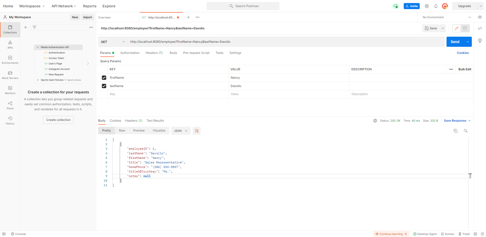
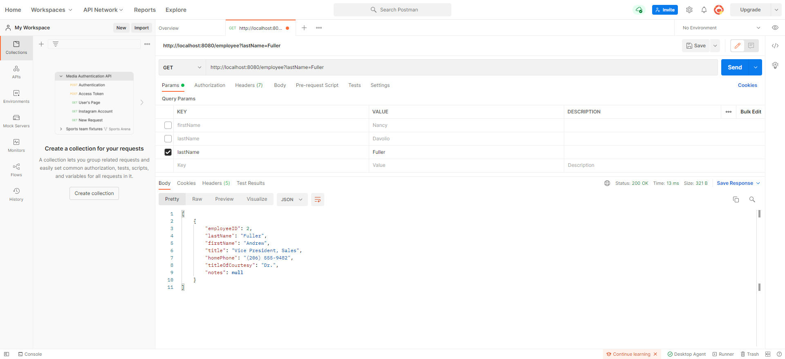
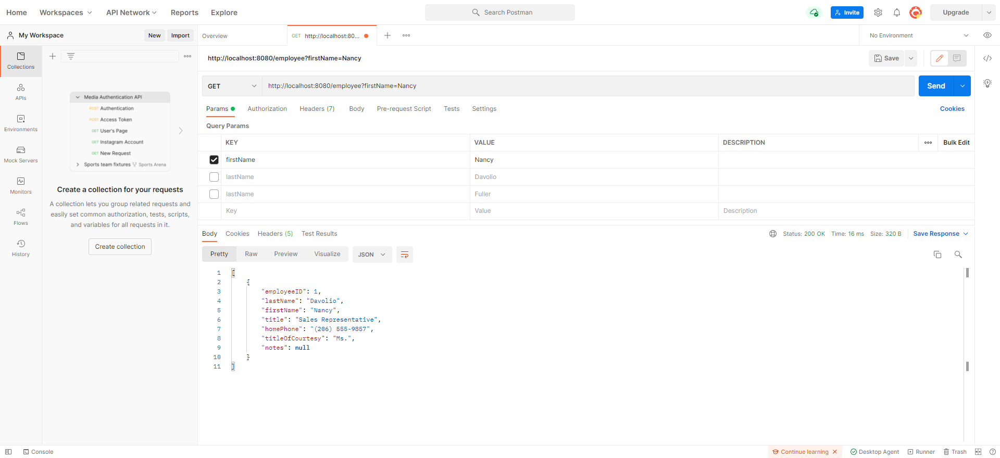
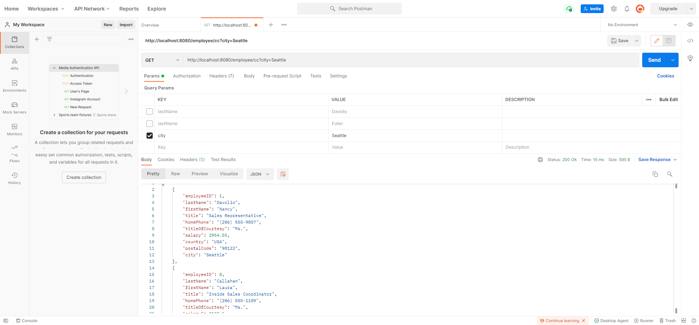
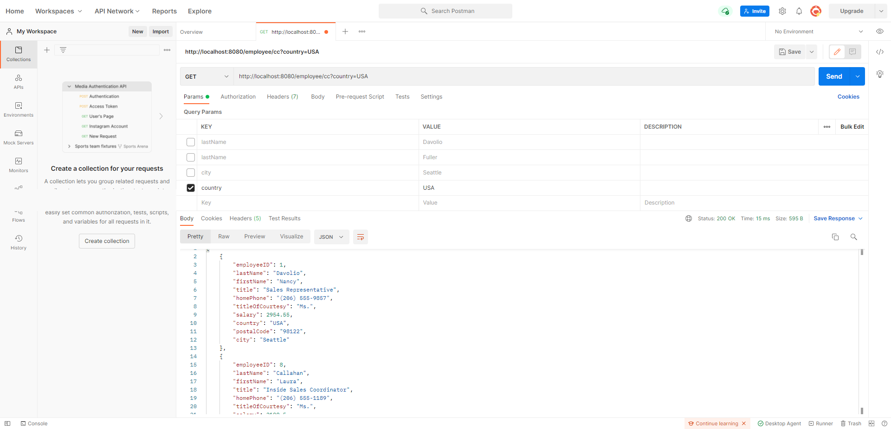
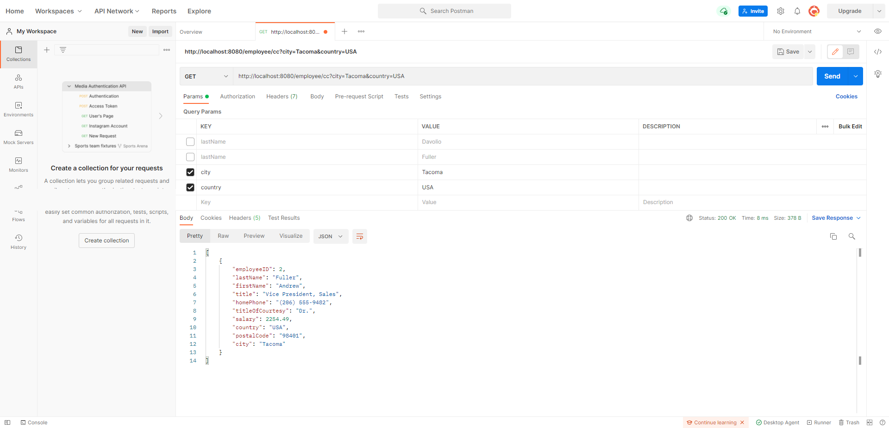

# **REST API Project**

___

## Table Of Content

- ##### Project Purpose
- ##### Maintenance/Aims
- ##### Java/Spring practices covered
- ##### Postman Testing
___

## Project Purpose
> The purpose of this project was to create an REST API application for the Northwind Database. Along with building the REST API I had to structure my own endpoint URLS and implement code to allow users to query the data and endpoints of the URLs.

> My project targeted quality more than quantity. I found many ways in which I could query data but after testing and trying different ways. Java specifications was a new and more efficient way for me to query my data and pull out results from the data to that match the specifications.
___

## Maintenance/Aims
> This project is still going to be edited and modified. The next phase will be to implement more URLs and endpoints along with more complex queries that would suit the database.
___

## Practices Covered
- DAOs
- Error handling
- URLs and endpoints
- Querying endpoints
- Using Postman for testing
- Java Specifications

##Postman Testing
>
>
>
>
>
>
>
